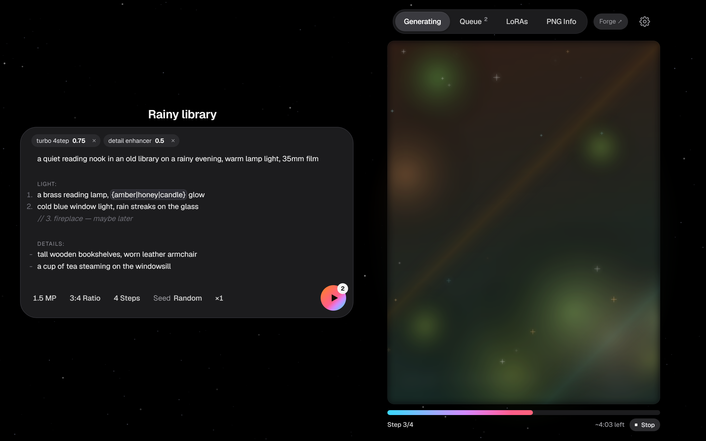

# Kiln

[English](README.md) · **Русский**

**Спокойный интерфейс с очередью для [Forge Neo](https://github.com/Haoming02/sd-webui-forge-classic/tree/neo) — сделан под Krea 2 на скромных видеокартах.**

Набросали очередь, закрыли дверь, вернулись к готовым картинкам. Kiln — приложение в одном окне для тех, кому
нужно качество Krea 2 без стены настроек Gradio и без графа нод, и кто генерирует на железе, где одна картинка
занимает минуты, а не секунды.

> **Статус: ранний, рабочий.** Kiln управляет локальным Forge Neo через его API: настоящая очередь, живое превью,
> ваши LoRA и модели. Если открыть `index.html` просто как файл, он работает как демо с имитацией генерации.

---

## Быстрый старт

Нужны **Windows**, **[Forge Neo](https://github.com/Haoming02/sd-webui-forge-classic/tree/neo)** с моделью Krea 2
и **Python 3.10 или новее** ([python.org](https://www.python.org/downloads/) — в установщике отметьте
*«Add python.exe to PATH»*). Сам Kiln ничего не устанавливает.

1. **Включите API у Forge.** В файле Forge `webui-user.bat` добавьте `--api` в `COMMANDLINE_ARGS`, например
   `set COMMANDLINE_ARGS=--api`. Запустите Forge один раз и убедитесь, что он работает сам по себе.
2. **Скачайте Kiln.** На этой странице: **Code → Download ZIP**, распакуйте куда угодно (или `git clone`).
3. **Дважды щёлкните `kiln.bat`.** Он запустит сервер Kiln и откроет Kiln в отдельном окне Edge.
   Если Edge нет — откроется в браузере по умолчанию.
4. **Напишите промпт и нажмите ▶** (или `Ctrl+Enter`). Пока картинка рендерится, можно писать следующий.

**Необязательно — один ярлык на всё.** Скопируйте `config.example.json` в `config.local.json` и укажите в
`"forge_start"` полный путь к `webui-user.bat` от Forge (в JSON обратные слэши пишутся дважды:
`"C:\\Forge\\webui-user.bat"`). Тогда Kiln сам запускает Forge (свёрнутым), если тот не запущен, и закрывает его,
когда вы закрываете Kiln — но только если Forge запустил именно Kiln и им больше никто не пользуется
(`"stop_forge_on_exit": false` оставляет его работать).

**Настройки по умолчанию.** Kiln стартует с настройками под Krea 2 Turbo: 4 шага, CFG 1, Euler / Simple,
shift 1.15. Меняются в ⚙ Настройках. Модель, VAE и текстовый энкодер по умолчанию — те, что уже загружены в Forge.

**Если что-то не так**

| Что видите | Что попробовать |
|---|---|
| «Forge not running» | Forge не запущен, нет `--api`, или он не на порту 7860 (задайте `"forge_url"` в `config.local.json`). |
| Окно Kiln открывается пустым | VPN или прокси перехватывает локальный трафик. Собственное окно Kiln его обходит; в другом браузере добавьте `127.0.0.1` в исключения. |
| `kiln.bat` не находит Python | Переустановите Python с отметкой *«Add python.exe to PATH»*. |
| Оценка времени неточная | Она учится на ваших запусках — после нескольких картинок одного размера выравнивается. |

---

## Возможности

**Сначала — очередь**
- ▶ / `Ctrl+Enter` добавляет в очередь; если ничего не идёт, генерация начинается сразу. Пишите дальше, пока она идёт.
- Перетаскивание меняет порядок, × удаляет, **Stop** отменяет текущую задачу. **×N** ставит пачку — со случайными
  сидами или по порядку от заданного.
- Щелчок по готовой задаче открывает её во вкладке Generating. Щелчок по ожидающей или текущей задаче — или по
  строке статуса под картинкой — показывает её промпт, не трогая ваш черновик; дальше **Reuse prompt** или
  **Reuse all** (с настройками, сидом и LoRA). Кнопки появляются, только если что-то изменят: *«Use this seed»*,
  когда отличается лишь сид.
- **Честная оценка времени** по вашей истории: медиана последних пяти запусков с тем же размером картинки и числом
  шагов, с обратным отсчётом во время рендера (на реальной истории ошибка вдвое меньше, чем у среднего по мегапикселям).
  Итог по очереди считается так же.

**Редактор промпта** (CodeMirror 6, с проверкой орфографии)

| Пишете | Выглядит как | Уходит в модель |
|---|---|---|
| `// заметка себе` | приглушённый комментарий · `Ctrl+/` включает и выключает | **убирается** |
| `{cream\|charcoal\|green} sweater` | пилюля варианта | **один вариант на задачу** — пачки получаются разными сами |
| пункты `1.` / `-` | маркеры висят на полях, перенесённые строки выровнены | как написано |
| `Outfit:` отдельной строкой | маленький заголовок раздела | как написано |
| `<lora:name:0.6>` | чип LoRA | как написано (его разбирает Forge) |

В очереди видно, какой вариант достался каждой задаче, так что удачный результат можно отследить.

**Картинка**
- Живое превью под мягкой вуалью, которая сходит по мере шагов; россыпь искр, когда готово.
- **Листайте** готовые картинки `←` / `→` или стрелками на картинке — в том числе во время рендера. На каждой
  видно её имя и промпт (серым, с Reuse); ✕ или `Esc` возвращают к черновику и живому превью. На последнем
  результате ✕ очищает холст (`←` возвращает картинку).
- Щелчок открывает **полноразмерный просмотр** (вписать ↔ 100%, колесо — масштаб, перетаскивание — сдвиг, стрелки —
  листание); двойной щелчок открывает файл в программе по умолчанию. При наведении: увеличить (upscale), открыть,
  показать в папке, сделать миниатюрой LoRA.
- Необязательное **имя серии** → файлы нумеруются: `rainy-library-001.png`, `-002`, … Без имени — дата и сид.

**Библиотека LoRA**
- Лица, Стили и Утилиты — компактными карточками (миниатюра, имя, переключатель, вес) в столько колонок, сколько
  помещается, по центру. Ползунок миниатюр меняет размер карточек. **Активные** LoRA — сверху, их вес можно править прямо там.
- Читаемые имена из типичных имён файлов (`krea2_<name>_v2_large_onetrainer` → *Name · v2 · large*),
  двойной щелчок — переименовать, избранное, недавние, поиск.
- **Одно лицо за раз** — LoRA меняют веса всей модели, поэтому две LoRA лиц сливаются в одно лицо; Kiln заменяет
  одну другой, а не складывает (отключается).

**Раскладка**
- Блок промпта сохраняет ширину, которую вы ему дали (разделитель, до 900 px). Перетащите его за любое пустое
  место — он прилипнет к верху, середине или низу картинки; или включите **по высоте картинки** / **во всю высоту**.
- Правый блок — картинка, Queue, LoRAs, PNG Info — один и тот же прямоугольник на всех вкладках, он и поглощает
  изменения размера окна; оба блока центрируются вместе. В узком окне картинка встаёт над промптом, границу между
  ними можно двигать.

**Ещё**
- PNG Info: перетащите любой PNG из Forge, чтобы прочитать настройки и отправить их в промпт.
- Выбор пропорций с превью формы · пресеты ~1 / 1.5 / 2 МП (все стороны кратны 16).
- Заголовок окна и иконка вкладки показывают прогресс; уведомление, когда очередь опустела (вкл., без звука или выкл.).
- Закрытие окна Kiln останавливает сервер, как только очередь закончится.
- Темы для кнопки ▶ и полосы прогресса; шрифты: Geist, Inter, Satoshi, Manrope, IBM Plex Sans.

## Как это устроено

`server.py` (только стандартная библиотека Python) держит очередь — она сохраняется в `data/queue.json` и
переживает перезапуск — и отдаёт Forge задачи по одной; собственный интерфейс Forge при этом продолжает работать.
Картинки сохраняются в `outputs/` с вшитыми параметрами генерации, так что PNG Info (в Kiln или в Forge) может их
прочитать. Модель и модули в ⚙ Настройках по умолчанию — те, что загружены в Forge; выберите другие, и Kiln
переключит их перед задачей. `index.html` — весь интерфейс целиком: один файл, без сборки.

**Папки LoRA.** Kiln берёт список LoRA из Forge. Кладите LoRA лиц в подпапку `people` (или `faces`, `characters`),
стили — в `style`; названия папок настраиваются в `config.local.json`.

**Демо и разработка.** Откройте `index.html` напрямую — будет демо с имитацией, или запустите
`python tools/fake_forge.py` и направьте Kiln на него (`KILN_FORGE_URL=http://127.0.0.1:7861 python server.py`),
чтобы прогнать весь путь без видеокарты. Шрифты и редактор грузятся с CDN; без интернета Kiln переходит на
системные шрифты и обычное текстовое поле.

## Принципы дизайна

Несколько правил, которым следует интерфейс, — на случай, если захотите развивать его в том же духе:

- **Один акцент.** Цвет темы — только на кнопке ▶ и полосе прогресса. Значения, ползунки и выделение
  нейтральные; переключатели — один системный синий для «вкл.».
- **Чистый чёрный, одно разделение на границу.** Фон `#000`, панели `#1C1C1E`, тонкие обводки в 1px —
  никаких теней на чёрном.
- **Картинка — без подложки, текст — на панелях.** Списки лежат на панели, картинка — нет.
- **Ничего не прыгает.** Строка статуса всегда на месте, переключение вкладок ничего не сдвигает.
- **Страница не прокручивается.** Промпт растёт по содержимому, а потом прокручивается внутри.
- **Движение со смыслом.** Вуаль — картинка ещё не готова, искры — только что готова; звёздное небо приглушено.
  Пока вы меняете размер окна, ничего не анимируется.

## Планы

1. ~~Подключение к Forge Neo~~ — очередь, живое превью, настоящие LoRA и модели, upscale, открыть / показать в папке.
2. ~~Окно приложения и один ярлык~~ — `kiln.bat`, запуск и остановка Forge по желанию.
3. **img2img** из действий при наведении на картинку.
4. Перетаскивание готовых картинок прямо в Photoshop или Проводник.
5. Возможно: бэкенд на ComfyUI за тем же интерфейсом.

## Благодарности

[Forge Neo](https://github.com/Haoming02/sd-webui-forge-classic/tree/neo) ·
[CodeMirror 6](https://codemirror.net/) · шрифты: Geist, Inter, Manrope, IBM Plex Sans (Google Fonts), Satoshi
(Fontshare). Kiln не связан с Krea.

## Лицензия

[MIT](LICENSE)
